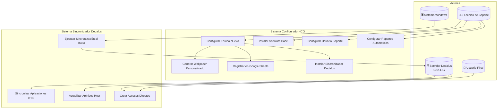
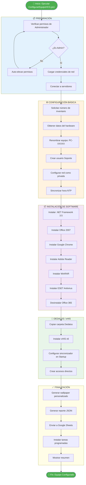
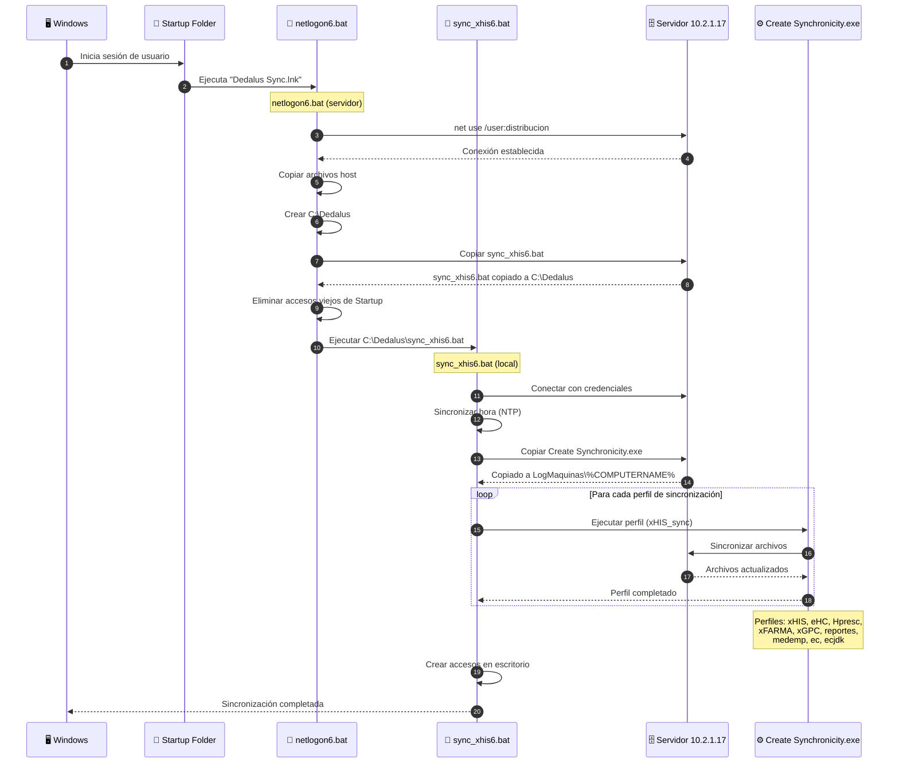
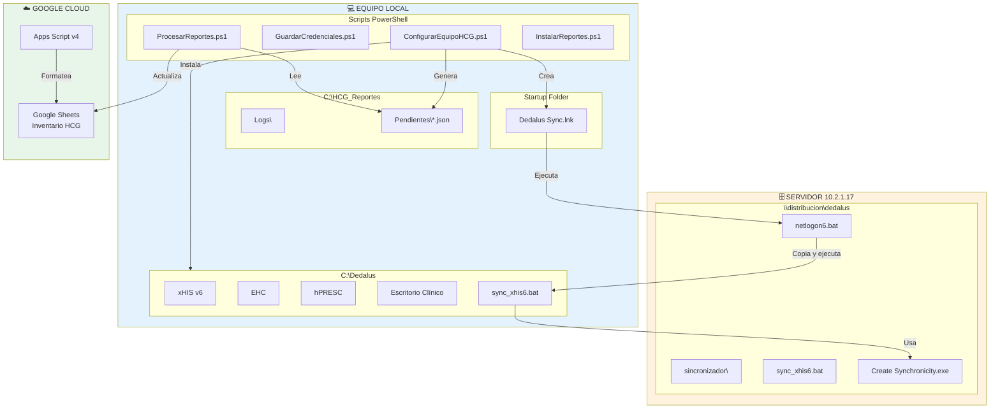
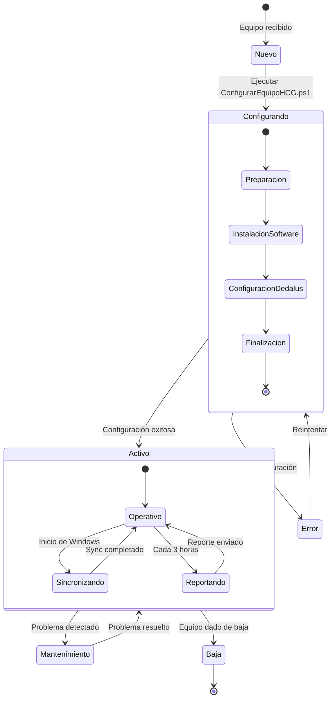
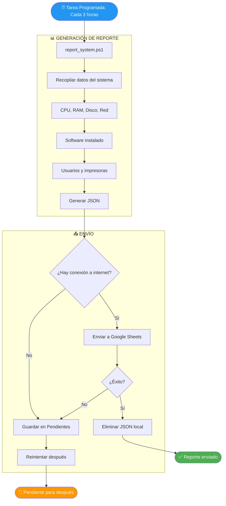
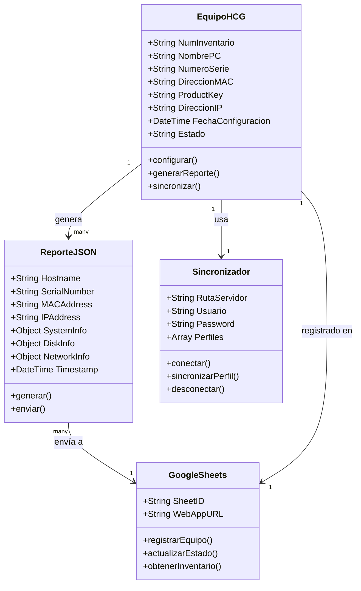
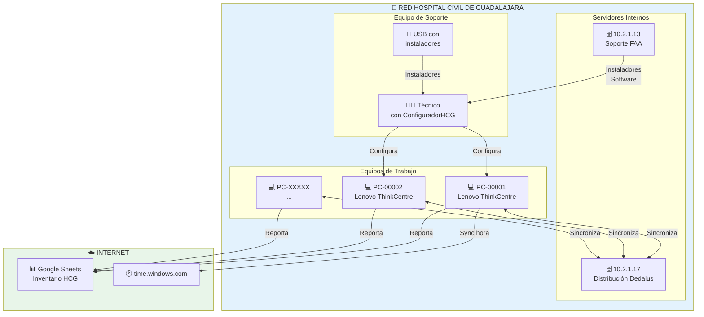

# Diagramas UML - ConfiguradorHCG
## Hospital Civil de Guadalajara - Coordinación General de Informática

---

## 1. Diagrama de Casos de Uso

---

## 2. Diagrama de Flujo - Configuración de Equipo Nuevo

---

## 3. Diagrama de Secuencia - Sincronización Dedalus al Inicio

---

## 4. Diagrama de Componentes

---

## 5. Diagrama de Estados - Ciclo de Vida del Equipo

---

## 6. Diagrama de Flujo - Reportes Automáticos

---

## 7. Diagrama de Clases - Estructura de Datos

---

## 8. Diagrama de Despliegue

---

## Notas

- Estos diagramas están en formato **Mermaid**
- Se pueden visualizar en:
  - GitHub (automático en archivos .md)
  - GitLab (automático)
  - VS Code (extensión Mermaid)
  - [Mermaid Live Editor](https://mermaid.live/)
  - Notion, Obsidian, etc.

---

*Generado para: Hospital Civil de Guadalajara - Coordinación General de Informática*
*Sistema: ConfiguradorHCG*
*Fecha: 2026-02-11*
